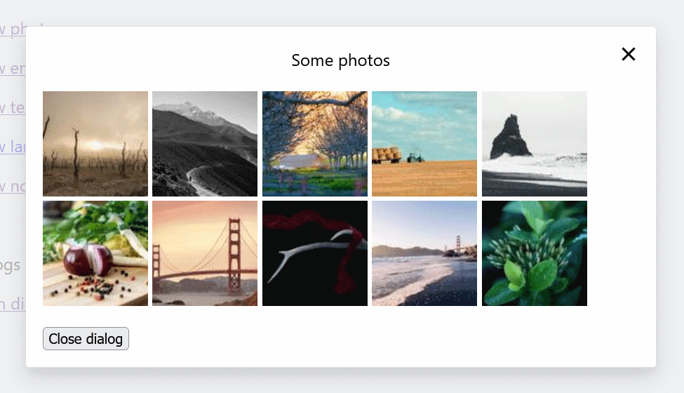

## Modal dialog on pure JavaScript



Displays a title and custom content.

Works in all modern browsers, ie11+ (ie9 with some artifacts).

Uses flexible elements for alignment, support scroll for large content.

## How to run

Open in browser:
https://miptleha.github.io/js-modal/

Or download and run locally:
```
git clone https://github.com/miptleha/js-modal.git
cd js-modal
npm it
```

All code inside [index.html](index.html)

## How to use

There is one common template for all dialogs (determines the placement and appearance of dialog elements).

Dialog markup defines only header and content of dialog.

Sample dialogs:
```html
<a href="#dialog-sample" class="open-dialog">Open dialog</a>
<div id="dialog-sample" class="dialog">
    <div class="dialog__header">Header text</div>
    <div class="dialog__content">Any html content</div>
</div>

<a href="#dialog-sample2" class="open-dialog">Open dialog2</a>
<div id="dialog-sample2" class="dialog">Dialog without header</div>
```

To use the dialog on your site, you need to copy the styles, template and JavaScript code from [index.html](index.html)